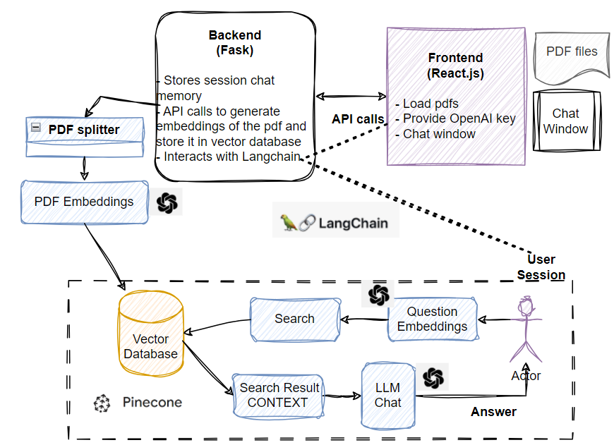

# EquiAssist
## Chat with multiple Pdf files
This chatbot uses OpenAI to create embeddings of uploaded pdf which is stored in a vector database (Pinecone). LangChain is used to managed the user session. The answers to the user query is based on context from the uploaded pdfs and previous chats.

## Chatbot Design Architecture
